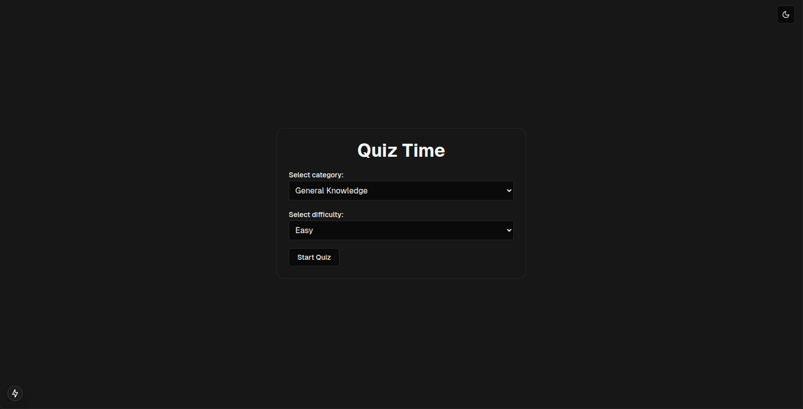

## Preview

Preview showing the dark mode version.

## About the app

This app uses the:
1. Open Trivia Database API to get questions
2. NextJs to handle the question and answer logic.
3. ShadCN to build the components
4. Next-themes to handle dark/light/system theme toggle.
